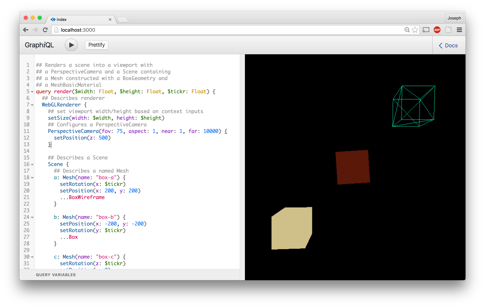

three.graphql
=============

Declare a Three.js program with GraphQL

## status

fun, wip, diy

## why ?

to experiment

## how ?

`three.graphql` utilizes a
[GraphQL](https://github.com/graphql/graphiql) implementation to build and maintain
a scene tree. [Three.js](https://github.com/mrdoob/three.js/) objects are created
when they don't exist and properties are changed when there is a difference
A GraphQL query represents the state of a Three.js program at any moment in
the current context. Objects are created and destroyed when the query changed.
Input properties are merged into existing objects.

## License

MIT

